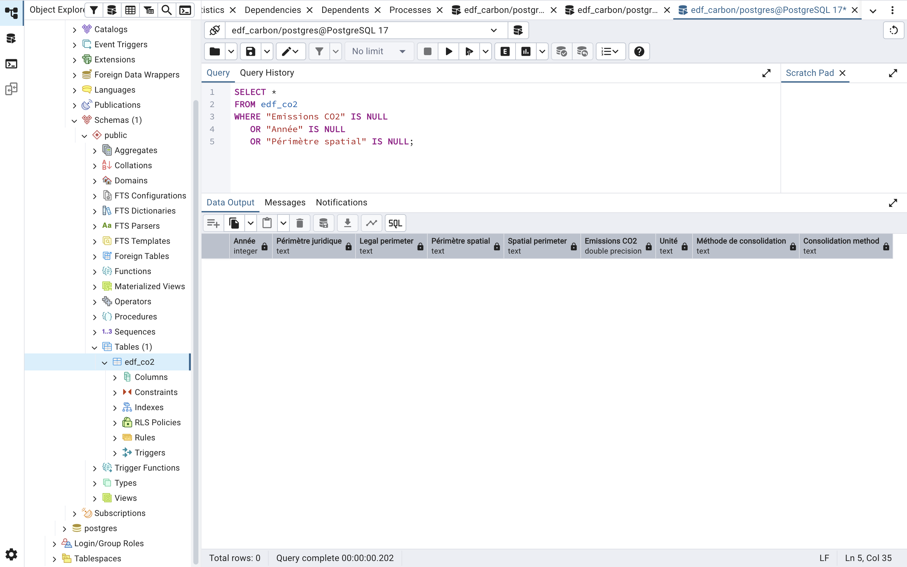
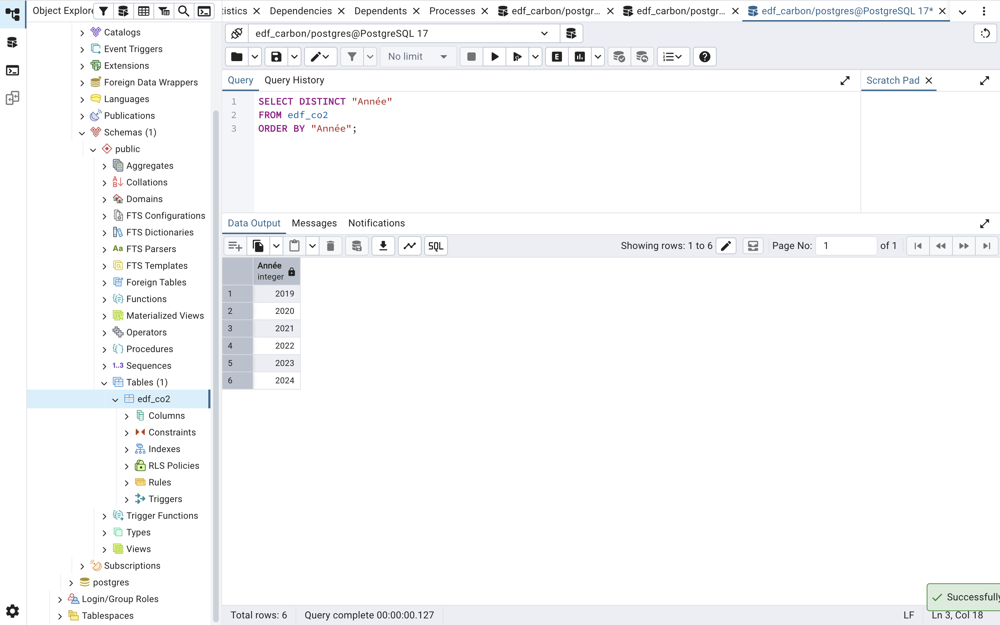
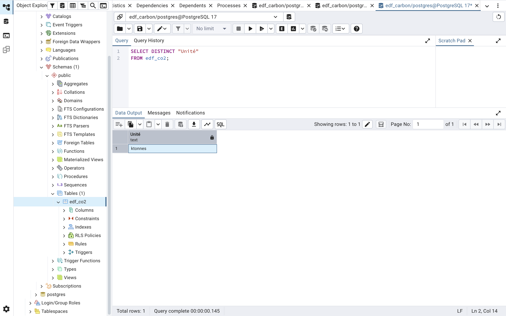
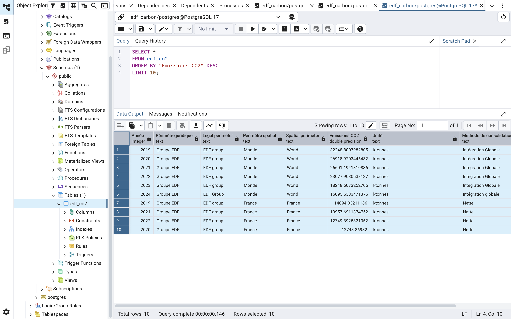
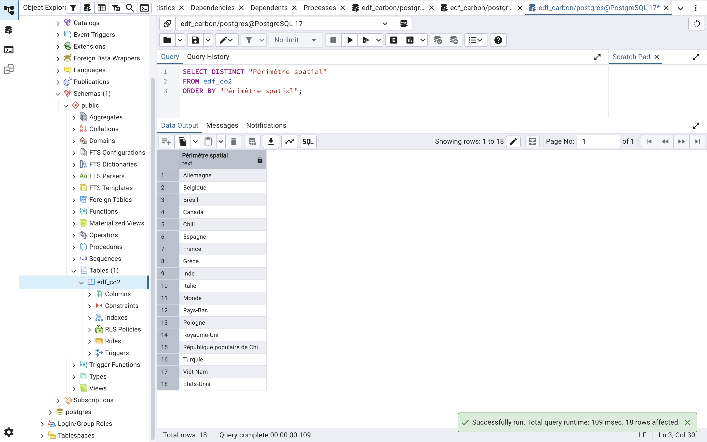
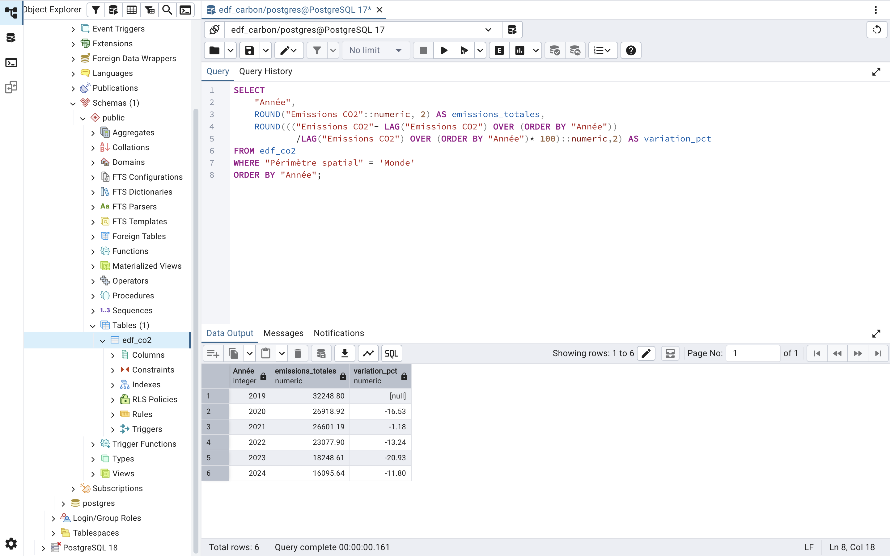

# EDF-Carbon-Analysis

# EDF Carbon Emissions Analysis (2019–2024)

End-to-end data analysis project exploring EDF Group's CO₂ emissions trends across countries and over time (2019–2024), using Open Data, PostgreSQL, SQL, and Python.

## Executive Summary

This project analyzes EDF Group’s CO₂ emissions over the 2019–2024 period in order to identify carbon reduction trends, the geographical distribution of emissions, and the main contributing countries.

### Key Insights
- EDF's total CO₂ emissions decreased by approximately 48% between 2019 and 2024.
- France accounted for approximately 40–45% of the Group's total emissions over the period.
- Emissions are highly concentrated in a limited number of countries.
- The decline in emissions accelerated from 2022 onwards.
- The overall trend suggests a gradual transition toward a lower-carbon energy mix.

---

## 1. Project Overview

### Project Objective

The objective of this project is to:

- Analyze EDF Group's CO₂ emissions
- Identify the highest-emitting countries
- Study emission trends over time

---

## 2. Technologies Used

| Tool | Purpose |
|------|------------|
| PostgreSQL | Data storage and querying |
| SQL | Data analysis and exploration |
| Python | Data visualization |
| GitHub | Versioning and portfolio |

---

## 3. Data import and structuring

### Data Description

Source: Open Data EDF

Scope: consolidated CO₂ emissions by country

Period: 2019 → 2024

Unit: ktonnes CO₂

Level: groupe EDF (périmètre international)

### Database

The data was imported into a PostgreSQL database with the following structure:

```sql
CREATE TABLE edf_co2 (
    "Année" INT,
    "Périmètre juridique" TEXT,
    "Legal perimeter" TEXT,
    "Périmètre spatial" TEXT,
    "Spatial perimeter" TEXT,
    "Emissions CO2" FLOAT,
    "Unité" TEXT,
    "Méthode de consolidation" TEXT,
    "Consolidation method" TEXT
);

```
### Execution Evidence (PostgreSQL)

#### Table Creation


#### CSV Data Import


---

## 4. Data Cleaning

### 4.1. Missing Values Check

#### Objective : Missing Values Check
Identify missing data that could bias statistical analyses and SQL aggregations.

#### SQL Query
Do the data contain missing values that could affect the analysis?
```sql
SELECT *
FROM edf_co2
WHERE "Emissions CO2" IS NULL
   OR "Année" IS NULL
   OR "Périmètre spatial" IS NULL;
```

#### Result



No NULL values were detected in the analyzed columns.

#### Interpretation

The dataset is complete and suitable for statistical and time-series analysis.

### 4.2. Duplicate checking

#### Objective : Detect duplicate imports
This analysis aims to identify potential duplicates in the imported data in order to avoid overestimation of emissions.

#### SQL Query
Have any rows been imported multiple times into the database?
```sql
SELECT "Année",
       "Périmètre spatial",
       COUNT(*)
FROM edf_co2
GROUP BY "Année", "Périmètre spatial"
HAVING COUNT(*) > 1;
```

#### Result


No duplicates were identified in the data.

#### Interpretation

Each year/spatial boundary combination appears only once in the database, ensuring the consistency of the analysis.

### 4.3. Negative Values Check

#### Objective : Detect inconsistent values
Since carbon emissions are positive values, this check helps identify potential data entry errors or anomalies in the dataset.

#### SQL Query
Are there any inconsistent or negative emission values in the dataset?
```sql
SELECT *
FROM edf_co2
WHERE "Emissions CO2" < 0;
```

#### Result


No negative values were detected.

#### Interpretation

The carbon emissions data shows consistent values that are compatible with the environmental analyses performed.

### 4.4. Available Years Check

#### Objective : Verify the study period
This check confirms that the data correctly covers the study period 2019–2024.

#### SQL Query
Do the data correctly cover the entire 2019–2024 study period?
```sql
SELECT DISTINCT "Année"
FROM edf_co2
ORDER BY "Année";
```

#### Result



The dataset covers the entire period from 2019 to 2024.

#### Interpretation

The continuity of the dataset allows reliable trend analysis over time.

### 4.5. Units Consistency Check

#### Objective : Ensure that all emissions are reported using the same unit of measurement.
This check ensures that all variables are expressed in consistent and appropriate units in order to guarantee the reliability and comparability of the results.

##### SQL Query
Are all emissions expressed using the same unit?
```sql
SELECT DISTINCT "Unité"
FROM edf_co2;
```
#### Result



All data are reported in kilotonnes (ktCO₂).

#### Interpretation

The consistency of measurement units ensures reliable comparisons across countries and years.

### 4.6. Verification of extreme values

#### Objective : Identify unusually high emission values.
This analysis helps identify the spatial perimeter with the highest emissions, as well as any potential statistical anomalies.

#### SQL Query
Which spatial perimeter have the highest emissions?
```sql
SELECT *
FROM edf_co2
ORDER BY "Emissions CO2" DESC
LIMIT 10;
```

#### Result

The highest values mainly correspond to the global scope ("World"), followed by France.
Global emissions gradually declined between 2019 and 2024.

#### Interpretation



The observed values are consistent with the scope of the study and highlight the significant contribution of the global perimeter and the overall downward trend in EDF's carbon emissions.

### 4.7. Spatial Perimeter Consistency Check

#### Objective : Identify naming inconsistencies.
The different values in the "Spatial Perimeter" field were reviewed to identify any potential naming inconsistencies.

#### SQL Query
Are there any naming inconsistencies across countries or geographical scopes?
```sql
SELECT DISTINCT "Périmètre spatial"
FROM edf_co2
ORDER BY "Périmètre spatial";
```

#### Detected Inconsistencies


A naming inconsistency was identified for China.

The values "People's Republic of China" and "People's republic of China" differed only because of capitalization and were therefore treated as separate categories by PostgreSQL.

This issue could lead to duplicate analyses, incorrect averages and misleading country rankings.

#### Correction Applied


A data normalization procedure was performed to standardize country labels.

```sql
UPDATE edf_co2
SET "Périmètre spatial" = 'République populaire de Chine'
WHERE "Périmètre spatial" = 'République Populaire de Chine';
```

#### Verification After Correction

A new validation was performed to confirm data consistency.
```sql
SELECT DISTINCT "Périmètre spatial"
FROM edf_co2
ORDER BY "Périmètre spatial";
```



#### Conclusion

This cleaning process improved the quality and reliability of the analysis and illustrates the importance of data preparation in ESG and environmental analytics projects.

---

## 5. Analyses Performed

### 5.1. Global Emissions Trend
Analysis of EDF Group's global CO₂ emissions between 2019 and 2024.

#### Main SQL Query
How did EDF Group's global CO₂ emissions evolve between 2019 and 2024?
```sql
SELECT "Année",
       SUM("Emissions CO2") AS total_emissions
FROM edf_co2
WHERE "Périmètre spatial" = 'Monde'
GROUP BY "Année"
ORDER BY "Année";
```
#### Execution Evidence (PostgreSQL)


#### Interpretation

A gradual and continuous reduction in CO₂ emissions is observed over the entire period.

This trend may be explained by emissions reduction policies and the strengthening of carbon reporting requirements.

#### Conclusion

Between 2019 and 2024, global emissions followed a clear downward trajectory, suggesting a gradual improvement in environmental performance.

---

### 5.2. Top Emitting Countries (2024)
Identification of the highest CO₂-emitting countries in 2024 (excluding the global scope).

### Main SQL Query
Which countries generated the highest CO₂ emissions within EDF Group in 2024?
```sql
SELECT "Périmètre spatial",
       "Emissions CO2"
FROM edf_co2
WHERE "Année" = 2024
AND "Périmètre spatial" != 'Monde'
ORDER BY "Emissions CO2" DESC;

```

#### Execution Evidence (PostgreSQL)


#### Interpretation

The analysis of EDF Group’s CO₂ emissions in 2024 highlights a strong concentration of emissions in a few key countries.

France appears as the main contributor with more than 7,293 emission units, followed by Italy and China. This distribution reflects both the historical importance of EDF’s activities in Europe and its international presence across multiple energy markets.

The high emission levels observed in Italy and China can be explained by a significant industrial footprint, more carbon-intensive energy infrastructures, or national energy mixes that remain more dependent on fossil fuels.

Conversely, countries such as the United Kingdom, Canada, and India show very low emission levels within EDF’s scope, which may reflect a more limited presence of the Group, less carbon-intensive activities or a more decarbonized energy portfolio.

#### Conclusion

Overall, the results show that EDF Group’s carbon emissions are not evenly distributed across its countries of operation. A few geographical areas accounting for the majority of total emissions.

### 5.3. France vs World
Comparison of France's emissions with EDF Group's global emissions to assess its relative contribution.

#### Main SQL Query
What share of EDF Group's global emissions is represented by France?
```sql
WITH emissions AS (
    SELECT 
        "Année",
        MAX(CASE WHEN "Périmètre spatial" = 'France' 
            THEN "Emissions CO2" END) AS france,
        MAX(CASE WHEN "Périmètre spatial" = 'Monde' 
            THEN "Emissions CO2" END) AS monde
    FROM edf_co2
    GROUP BY "Année")

SELECT 
    "Année",
    ROUND(france::numeric,2) AS emissions_france,
    ROUND(monde::numeric,2) AS emissions_monde,
    ROUND((france / monde * 100)::numeric,2) AS poids_france_pct
FROM emissions
ORDER BY "Année";
```
#### Execution Evidence (PostgreSQL)


#### Interpretation

The comparative analysis between French emissions and global emissions of the EDF Group reveals a gradual decrease in CO₂ emissions over the 2019–2024 period.

Global emissions decline from approximately 32,249 in 2019 to 16,096 in 2024, reflecting a significant reduction in EDF’s overall carbon footprint. France follows a similar trend, with emissions decreasing from 14,094 to 7,294 over the same period.

Despite this decline, France continues to represent a substantial share of total Group emissions. On average, it accounts for between 40% and 45% of EDF’s global emissions over the study period.

This concentration can be explained by the historical importance of the French market for EDF, the scale of national energy infrastructure, and the centralization of a large share of the Group’s activities in France.

The results also suggest that EDF has followed a global decarbonization trajectory between 2019 and 2024, likely driven by energy transition policies, changes in the energy mix, the gradual phase-out of carbon-intensive activities, and improved environmental performance.

### 5.4. Average Emissions by Country

#### Main SQL Query
Which countries recorded the highest average emissions over the study period?
```sql
SELECT "Périmètre spatial", AVG("Emissions CO2") 
FROM edf_co2
GROUP BY "Périmètre spatial"
ORDER BY AVG("Emissions CO2") DESC;

```
#### Execution Evidence (PostgreSQL)


### 5.5. Variations annuelles des émissions

#### Main SQL Query 
What are the year-over-year changes in EDF Group's CO₂ emissions?
```sql
SELECT 
    "Année",
    ROUND(SUM("Emissions CO2")::numeric,2) AS emissions_totales,

    ROUND(((SUM("Emissions CO2")
	        - LAG(SUM("Emissions CO2"))OVER (ORDER BY "Année"))
			/LAG(SUM("Emissions CO2"))OVER (ORDER BY "Année"))::numeric * 100,2) AS variation_pct
FROM edf_co2
GROUP BY "Année"
ORDER BY "Année";
```

#### Execution Evidence (PostgreSQL)


#### Interpretation

The analysis of EDF Group’s CO₂ emissions between 2019 and 2024 shows an overall strong downward trend, with an approximate reduction of 48% over the period.

This decline is not linear. After a sharp drop between 2019 and 2020, emissions stabilize slightly in 2021 before resuming a more pronounced downward trajectory from 2022 onward.

The year 2023 marks the most significant decrease, with a drop of nearly 21%, indicating an acceleration in emission reduction efforts.

In 2024, the decrease continues but at a more moderate pace, suggesting a consolidation phase of environmental improvements.

#### Conclusion
Over the studied period, EDF exhibits a clear and structured decarbonization trajectory, with an acceleration of efforts starting in 2022. This evolution can be interpreted as the combined result of energy transition policies, operational optimization and a progressive transformation of the Group’s energy mix.

### 5.6. Top 10 Highest-Emitting Countries (2019–2024)

#### Main SQL Query
Which countries accounted for the highest cumulative CO₂ emissions over the 2019–2024 period?
```sql
SELECT "Périmètre spatial", SUM("Emissions CO2")
FROM edf_co2
GROUP BY "Périmètre spatial"
ORDER BY SUM("Emissions CO2") DESC
LIMIT 10;
```

#### Execution Evidence (PostgreSQL)


---

## 6. Python Visualizations

---

## 7. Overall Conclusion

This project analyzing the EDF Group’s carbon emissions highlights an overall downward trend in CO₂ emissions between 2019 and 2024.

The analysis shows that emissions are heavily concentrated in a few key countries. France accounts for a significant share of the Group’s total emissions, while global emissions follow a gradual downward trajectory over the period studied.

This project also demonstrates the combined use of PostgreSQL, SQL, and Python in a comprehensive data analysis approach applied to ESG and climate-related challenges.

Beyond the technical results, this study provides a better understanding of the geographical distribution of carbon emissions and the dynamics of the energy transition within a large international group.
