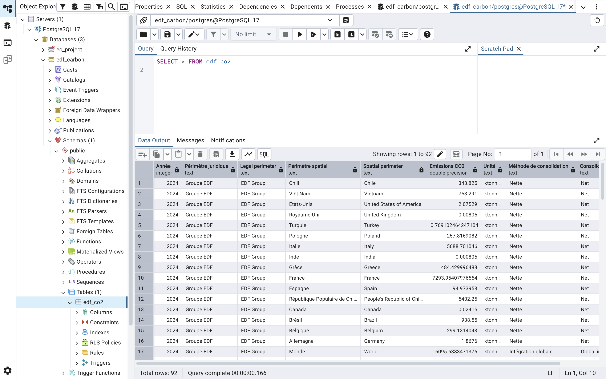
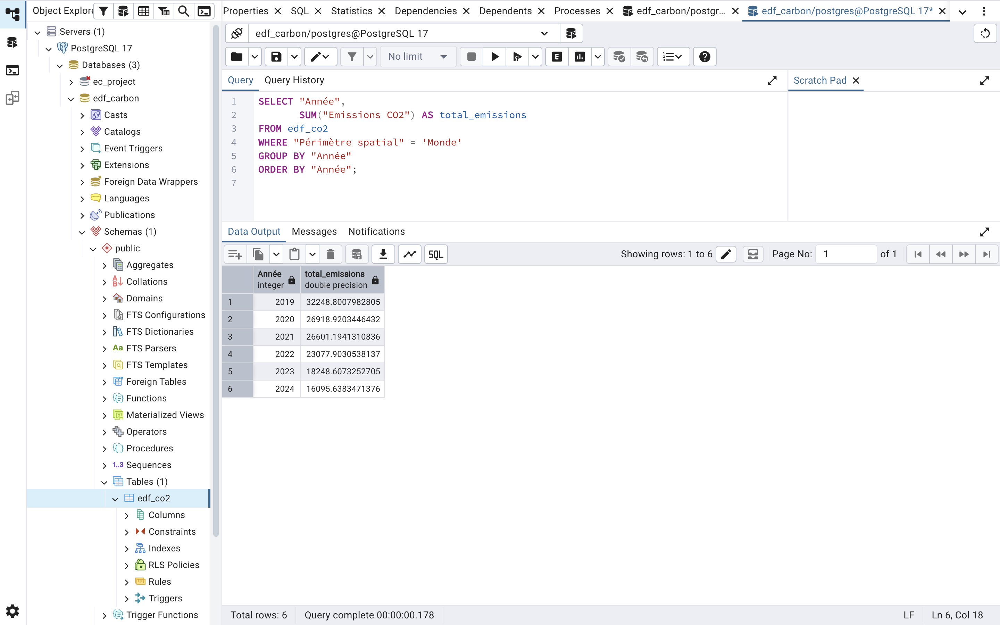
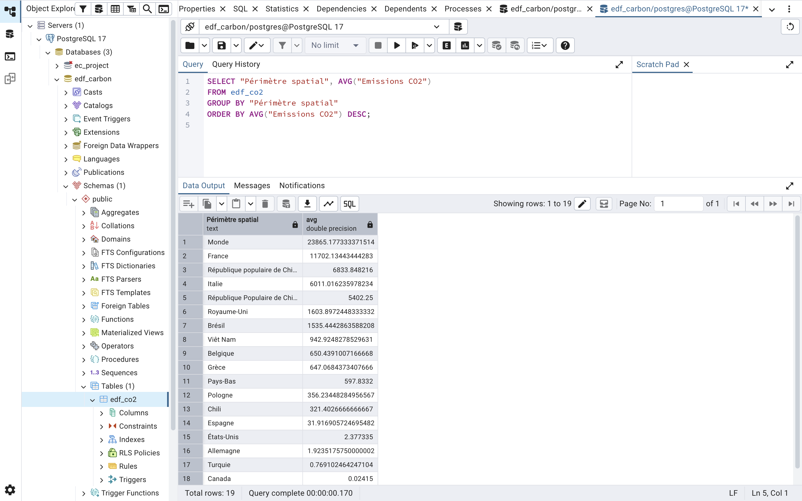
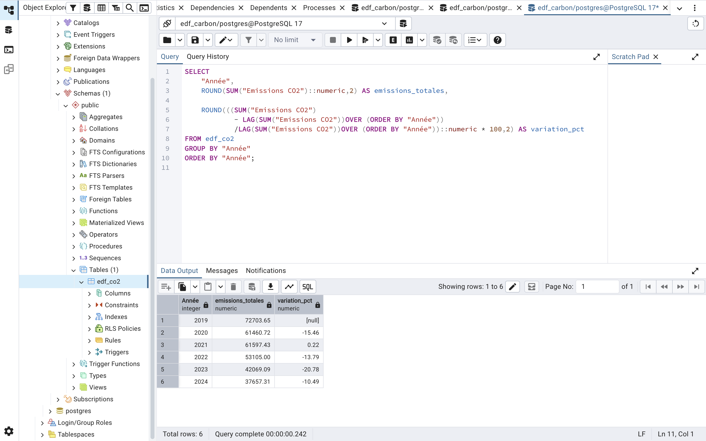
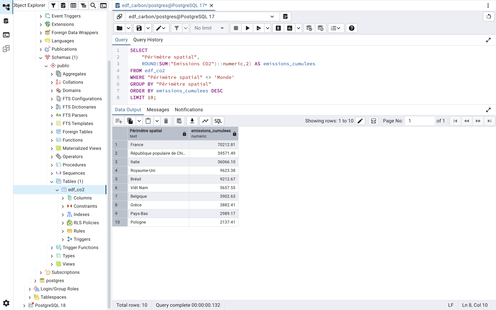

# edf-carbon-analysis

# EDF Carbon Emissions Analysis (2019–2024)

Projet d’analyse des émissions de CO₂ du groupe EDF par pays et par année, basé sur des données Open Data.

---

## 1. Présentation du projet

### Objectif du projet

Ce projet a pour objectif de :

- Analyser les émissions de CO₂ du groupe EDF
- Identifier les pays les plus émetteurs
- Étudier l’évolution des émissions dans le temps

---

## 2. Technologies utilisées

| Outil | Utilisation |
|------|------------|
| PostgreSQL | Stockage et requêtes sur les données |
| SQL | Analyse et exploration des données |
| Python | Visualisation des données |
| GitHub | Versioning et portfolio |

---

## 3. Import et structuration des données

### Base de données

Les données ont été importées dans une base PostgreSQL avec la structure suivante :

```sql
CREATE TABLE edf_co2 (
    "Année" INT,
    "Périmètre juridique" TEXT,
    "Legal perimeter" TEXT,
    "Périmètre spatial" TEXT,
    "Spatial perimeter" TEXT,
    "Emissions CO2" FLOAT,
    "Unité" TEXT,
    "Méthode de consolidation" TEXT,
    "Consolidation method" TEXT
);

```
### Preuves d’exécution (PostgreSQL)

#### Création de la table


#### Import des données CSV


---

## 4. Nettoyage des données

---

## 5. Analyses réalisées

### 5.1. Évolution des émissions mondiales
Analyse de l’évolution des émissions de CO₂ du périmètre mondial sur la période 2019–2024.

#### Requêtes SQL principales
```sql
SELECT "Année",
       SUM("Emissions CO2") AS total_emissions
FROM edf_co2
WHERE "Périmètre spatial" = 'Monde'
GROUP BY "Année"
ORDER BY "Année";
```
#### Preuves d’exécution (PostgreSQL)


#### Interprétation des résultats

On observe une réduction progressive et continue des émissions de CO₂ sur l’ensemble de la période.

Cette évolution peut s’expliquer par des politiques de réduction des émissions et le renforcement des obligations de reporting carbone.

#### Conclusion

Sur la période 2019–2024, le périmètre mondial analysé montre une tendance claire à la baisse des émissions de CO₂, suggérant une amélioration progressive de la performance environnementale.

---

### 5.2. Top pays émetteurs (2024)
Identification des pays les plus émetteurs de CO₂ en 2024 (hors périmètre global).

### Requêtes SQL principales
```sql
SELECT "Périmètre spatial",
       "Emissions CO2"
FROM edf_co2
WHERE "Année" = 2024
AND "Périmètre spatial" != 'Monde'
ORDER BY "Emissions CO2" DESC;

```

#### Preuves d’exécution (PostgreSQL)


#### Interprétation des résultats

L’analyse des émissions de CO₂ du groupe EDF en 2024 met en évidence une forte concentration des émissions sur quelques pays clés.

La France apparaît comme le principal contributeur avec plus de 7 293 unités d’émissions, suivie par l’Italie et la Chine. Cette répartition reflète l’importance historique des activités du groupe EDF en Europe ainsi que sa présence internationale sur plusieurs marchés énergétiques.

Les émissions élevées observées en Italie et en Chine peuvent s’expliquer par une présence industrielle importante, des infrastructures énergétiques plus carbonées ou des mix énergétiques nationaux davantage dépendants des énergies fossiles.

À l’inverse, certains pays comme le Royaume-Uni, le Canada ou l’Inde présentent des niveaux d’émissions très faibles dans le périmètre EDF, ce qui peut traduire une présence plus limitée du groupe, des activités moins intensives en carbone ou un portefeuille énergétique davantage orienté vers des énergies bas carbone.

#### Conclusion

Globalement, les résultats montrent que les émissions carbone du groupe EDF ne sont pas réparties uniformément entre les différents pays d’implantation. Quelques zones géographiques concentrent une part majeure des émissions totales du groupe.

### 5.3. France vs Monde
Comparaison des émissions de la France par rapport au total mondial afin d’analyser son poids relatif.

#### Requêtes SQL principales
```sql
WITH emissions AS (
    SELECT 
        "Année",
        MAX(CASE WHEN "Périmètre spatial" = 'France' 
            THEN "Emissions CO2" END) AS france,
        MAX(CASE WHEN "Périmètre spatial" = 'Monde' 
            THEN "Emissions CO2" END) AS monde
    FROM edf_co2
    GROUP BY "Année")

SELECT 
    "Année",
    ROUND(france::numeric,2) AS emissions_france,
    ROUND(monde::numeric,2) AS emissions_monde,
    ROUND((france / monde * 100)::numeric,2) AS poids_france_pct
FROM emissions
ORDER BY "Année";
```
#### Preuves d’exécution (PostgreSQL)


#### Interprétation des résultats

L’analyse comparative entre les émissions françaises et les émissions mondiales du groupe EDF met en évidence une diminution progressive des émissions de CO₂ sur l’ensemble de la période 2019–2024.

Les émissions mondiales du groupe passent d’environ 32 249 en 2019 à 16 096 en 2024, traduisant une réduction significative de l’empreinte carbone globale d’EDF. La France suit une tendance similaire avec une baisse des émissions passant de 14 094 à 7 294 sur la même période.
Malgré cette diminution, la France conserve un poids important dans les émissions totales du groupe. En moyenne, elle représente entre 40 % et 45 % des émissions mondiales d’EDF sur la période étudiée.

Cette concentration peut s’expliquer par l’importance historique du marché français pour EDF, la taille des infrastructures énergétiques nationales et la centralisation d’une partie importante des activités du groupe en France.

Les résultats suggèrent également qu’EDF a engagé une trajectoire globale de réduction carbone entre 2019 et 2024, potentiellement liée aux politiques de transition énergétique, à l’évolution du mix énergétique, à la fermeture progressive de certaines activités fortement émettrices ou à l’amélioration des performances environnementales.

### 5.4. Émissions moyennes par pays

#### Requêtes SQL principales
```sql
SELECT "Périmètre spatial", AVG("Emissions CO2") 
FROM edf_co2
GROUP BY "Périmètre spatial"
ORDER BY AVG("Emissions CO2") DESC;

```
#### Preuves d’exécution (PostgreSQL)


### 5.5. Variations annuelles des émissions

#### Requêtes SQL principales
```sql
SELECT 
    "Année",
    ROUND(SUM("Emissions CO2")::numeric,2) AS emissions_totales,

    ROUND(((SUM("Emissions CO2")
	        - LAG(SUM("Emissions CO2"))OVER (ORDER BY "Année"))
			/LAG(SUM("Emissions CO2"))OVER (ORDER BY "Année"))::numeric * 100,2) AS variation_pct
FROM edf_co2
GROUP BY "Année"
ORDER BY "Année";
```

#### Preuves d’exécution (PostgreSQL)


#### Interprétation des résultats

L’analyse de l’évolution des émissions de CO₂ du groupe EDF entre 2019 et 2024 met en évidence une tendance globale fortement baissière, avec une réduction d’environ 48 % sur la période étudiée.
Cette diminution n’est pas linéaire. Après une forte baisse entre 2019 et 2020, les émissions se stabilisent légèrement en 2021 avant de reprendre une trajectoire descendante plus marquée à partir de 2022.
L’année 2023 constitue le point le plus significatif de cette dynamique avec une baisse de près de 21 %, traduisant une accélération des efforts de réduction des émissions.
En 2024, la baisse se poursuit mais à un rythme plus modéré, suggérant une phase de consolidation des gains environnementaux.

#### Conclusion
Sur la période étudiée, EDF présente une trajectoire de réduction carbone nette et structurée, avec une accélération des efforts à partir de 2022. Cette évolution peut être interprétée comme le résultat combiné de politiques de transition énergétique, d’optimisation des opérations et de transformation progressive du mix énergétique du groupe.

### 5.6. Top 10 des pays les plus émetteurs sur la période 2019–2024 (émissions cumulées)

#### Requêtes SQL principales
```sql
SELECT "Périmètre spatial", SUM("Emissions CO2")
FROM edf_co2
GROUP BY "Périmètre spatial"
ORDER BY SUM("Emissions CO2") DESC
LIMIT 10;
```
#### Preuves d’exécution (PostgreSQL)


---

## 6. Visualisations Python

---

## 7. Conclusion générale

Ce projet d’analyse des émissions carbone du groupe EDF met en évidence une tendance globale à la réduction des émissions de CO₂ entre 2019 et 2024.

Les analyses réalisées montrent que les émissions sont fortement concentrées sur quelques pays clés, la France représente une part importante des émissions totales du groupe et que les émissions mondiales suivent une trajectoire baissière progressive sur la période étudiée.

Ce projet illustre également l’utilisation combinée de PostgreSQL, SQL et Python dans une démarche complète de data analyse appliquée aux enjeux ESG et climatiques.

Au-delà des résultats techniques, cette étude permet de mieux comprendre la répartition géographique des émissions carbone et les dynamiques de transition énergétique au sein d’un grand groupe international.
